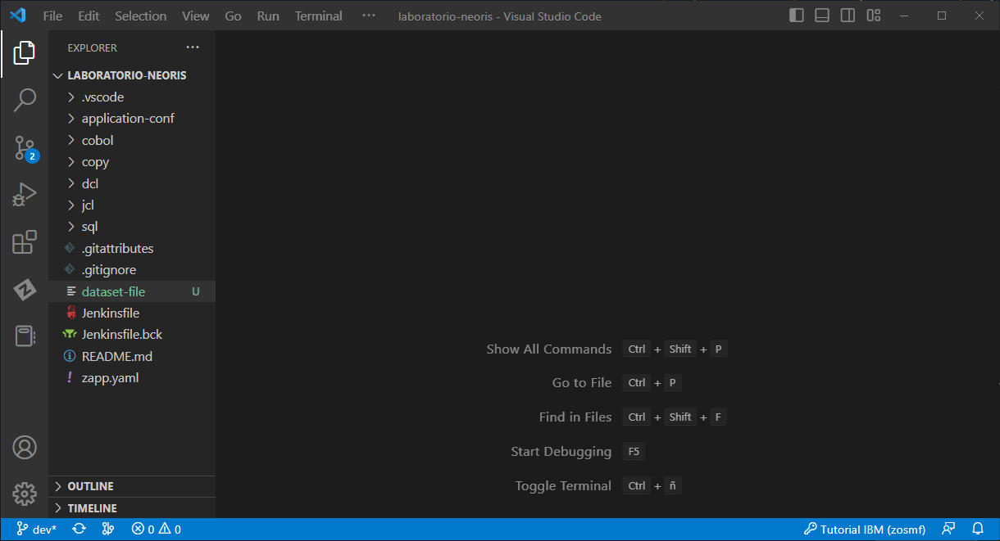
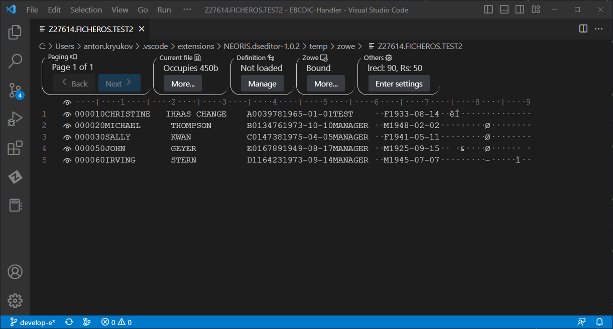
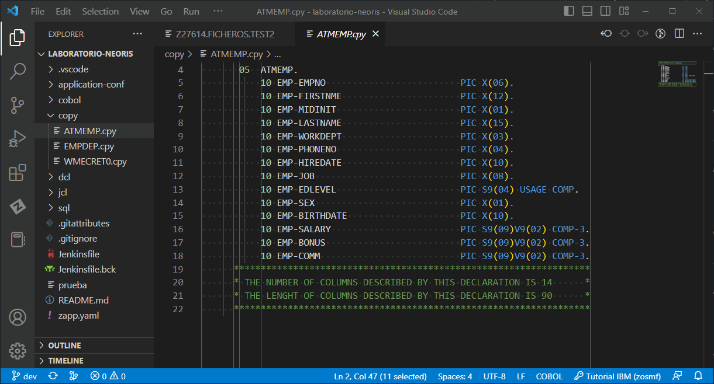
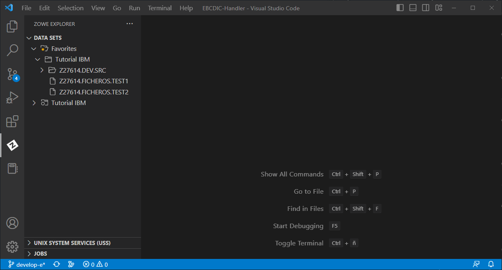

# DS Editor Extension for z/OS

**DataSet Editor Extension for z/OS. It's an extension for Visual Studio Code that provide fully support to EBCDIC encoding for Sequential Data Sets.**

This extension has been designed to help developers to manipulate  z/OS environment files, and for those teams have adopted the open source software for z/OS development and DevOps under IBM z platform. Provides fully hexadecimal integration and EBCDIC support for sequential data sets, allowing to load a Copybook (Layout) from your application repository or even the same MVS system (Using Zore Explore). The files are unload to the local system to increase the performance and can be sincronized with the z/OS system once the changes has completed.

## Features

- Read, Edit and Write EBCDIC (datasets) files
- Hexadecimal conversion
- Apply Layouts using Copybooks
  - Alpha-Numeric Supprot
  - Display Support
  - Binary Support
  - Comp-3 Support
- Zowe Explorer Compatibility

## Requirements

- To use the z/OS connection capabilities, it is required to have configured a ZOWE profile. A ZOWE profile, in turn, requires the mainframe to have "zosmf" or "rse api".

## Extension Settings

Currently, you can modify how zowe profiles are managed through [dseditor.whereToSaveProfile] and [dseditor.autoOverwriteProfile].

## Known Issues

For a list of known issues and to raise your own, visit [our github page](https://github.com/NEORIS-ZDEVOPS/DS-Editor/issues).

## How to use

### Open an editor

Prerequisite: Having the dataset file at hand.

1. Open the dataset file
   1. Select "Open Anyway"
   2. Choose DS Editor

### Peek at the underlying hexadecimal

Prerequisite: Having a dataset file opened, no copybook loaded.

1. Click the eye icon at the left of the lines.

### Load table view

Prerequisite: Having a dataset file opened and a copybook at hand.

1. Click "Manage" under definition
2. Click "Load Copybook"
3. Select the copybook layout file

### Load Dataset from Zowe explorer

Prerequisite: Having a ZOWE connection opened.

1. Right-click a dataset file
2. Select "Open with DS Editor"

*Since the file will be downloaded first to the local file system, it might take a while*
