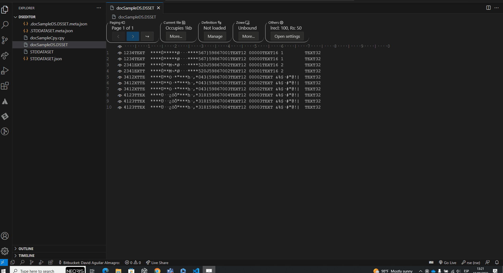
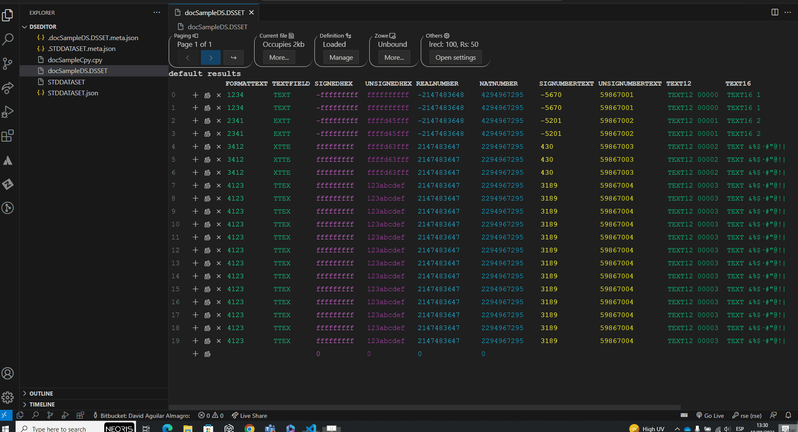

# NEORIS File Editor Extension for z/OS

## Table of contents
- [NEORIS File Editor Extension for z/OS](#neoris-file-editor-extension-for-zos)
	- [Table of contents](#table-of-contents)
	- [Introduction](#introduction)
	- [Use cases](#use-cases)
		- [Open an editor](#open-an-editor)
		- [Change from text to table mode](#change-from-text-to-table-mode)
		- [Change from table to text mode](#change-from-table-to-text-mode)
		- [Use editor with vsam files](#use-editor-with-vsam-files)
	- [Links](#links)

## Introduction

**File Editor Extension for z/OS. It's an extension for Visual Studio Code that provide fully support to EBCDIC encoding for Sequential Data Sets.**

This extension has been designed to help developers to manipulate  z/OS environment files, and for those teams have adopted the open source software for z/OS development and DevOps under IBM z platform. Provides fully hexadecimal integration and EBCDIC support for sequential data sets, allowing to load a Copybook (Layout) from your application repository or even the same MVS system (Using Zore Explore). The files are unload to the local system to increase the performance and can be sincronized with the z/OS system once the changes has completed.

Allows working with VSAM files (reading, creation, updating, and deletion of records), meeting the prerequisites

## Use cases

### Open an editor

Prerequisite: Having the dataset file at hand.

1. Open the dataset file
   1. Select "Open Anyway"
   2. Choose NEORIS File Editor

### Change from text to table mode

Prerequisite: Having a dataset file opened and a copybook or json at hand.

1. Click "Manage" under definition
2. Click "Load Copybook" or "Load from json"
3. Select the copybook layout or json file

### Change from table to text mode

Prerequisite: Having a  a copybook or json file opened and a  at hand.

1. Click "Manage" under definition
2. Click "Unload"

### Use editor with vsam files

Support with VSAM
Prerequisite: Having Neoris-vsamapi and IBM rseapi installed in mainframe and zowe explorer extension in vscode.

## Links

You can find more specific information in the following documents.

- [Text Mode functionality](./text_mode.md)
- [Table Mode functionality](./table_mode.md)
- [Zowe Explorer functionality](./zowe_explorer.md)
- [VsamApi functionality](./vsamapi.md)
