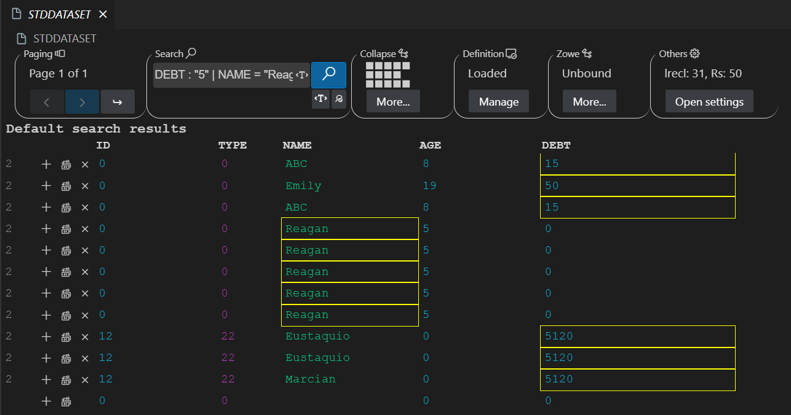
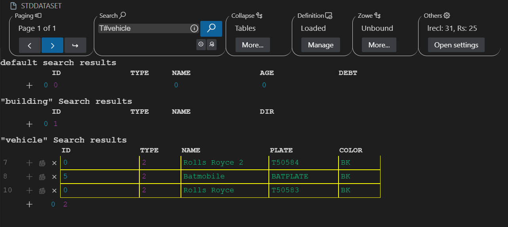
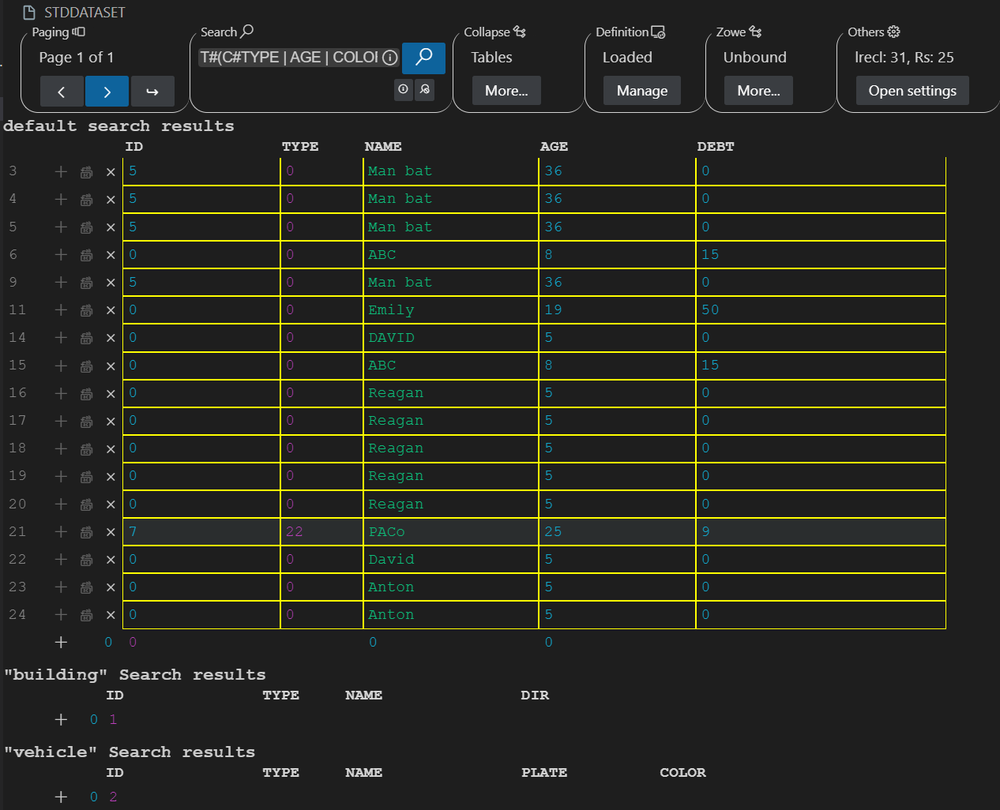

# Table mode documentation

## Table of contents
- [Table mode documentation](#table-mode-documentation)
	- [Table of contents](#table-of-contents)
	- [Introduction](#introduction)
	- [Color meanings](#color-meanings)
	- [Use cases](#use-cases)
		- [Insert row](#insert-row)
		- [Replace by default values](#replace-by-default-values)
		- [Delete row](#delete-row)
		- [Modify field](#modify-field)
		- [Navigate to another page](#navigate-to-another-page)
		- [Undo](#undo)
		- [Redo](#redo)
		- [Collapse](#collapse)
		- [Search](#search)
			- [Advanced Search](#advanced-search)

## Introduction
The table mode enables the differentiation and editing of data types within a dataset, with a dedicated field for each data type.

## Color meanings

The colors indicate what data you can expect the fields to have.

- Normal green: Text and numbers. Anything the EBCDIC codification allows.

	

- Bright green: Should be a number formated in a specified way.

	

- Normal magenta: Hexadecimal natural number.

	

- Bright magenta: Hexadecimal number.

	

- Normal cyan: Decimal natural number.
	
	

- Bright cyan: Decimal number.
	
	

- Normal yellow: Hexadecimal natural number.
	
	

- Bright yellow: Hexadecimal number.
	
	

Clarity note:
 - Natural means it won't have negative sign otherwise, you can expect one.
 - Hexadecimal means it may have digits from "0" to "9" and from "a" to "f".
 - Decimal means it may have digits from "0" to "9".

## Use cases

### Insert row

1. Click on the "insert Row" icon, represented by a plus sign
2. This will add a copy of the line below

### Replace by default values

1. Click on the "replace by default values" option
2. This will replace the field values with the value

### Delete row

1. Click on the "delete row" option
2. This will delete the selected row

### Modify field

1. Double click on the field
2. Put the correct value for that type of field
3. Press enter key

### Navigate to another page

Prerequisite: If the selected number of rows per page is smaller than the number of rows, pagination will be activated, showing page 1 of total numer of pages.

1. Click on the right-arrow icon to move to the next page.
2. Click on the left-arrow icon to move to the previous page.
3. Click on the arrow with the 'enter' symbol and input a number within the page range to go directly to that page.

### Undo

1. Press ctrl+z to undo the last action

### Redo

1. Press ctrl+y to redo the last action

### Collapse

1. Click on the collapse header menu.
2. Click on the collapse button to to collapse the entire table.
3. Click on the show button to expand the entire table.
3. Click on the field button to collapse/expand each field column.

### Search

1. Click on the search header input
2. Enter the string and click the search button(magnifying glass)
3. Navigate forward through the matches by clicking on the table and pressing the Tab key.
4. Navigate back through the matches by clicking on the table and pressing the Shift key.
5. Cancel the search mode by clicking the X button on the search header menu.

Notes: 
- If the search results contain multiple tables, to navigate between them you need to give focus by clicking on the one you want to move to.
- If the search results span multiple pages, we can still navigate through the resulting pages using the pagination menu buttons.
- If the search does not return any result, a warning message will be launched:"There are no matches".

#### Advanced Search
The advanced search allows to search in multiple columns from a table in normal mode(include) and exhaustive mode(exactly the same)

1. Click on the advanced search button to enable advanced search 
2. An advance search icon will appear into the input box when the advanced search is enabled 
3. Click the advanced search button or cancel search button to disable the advanced search.
3. Click on the search header input
4. Enter a valid pattern for advanced search (Search for valid patterns in the pattern section).
5. The rest of functionality is the same as normal search.

- Notes:
	- If the search does not return any result, a warning message will be launched: "There are no matches".
	- To use include search use ":" before the string, for exhaustive search use "=" .
	- Only search in one table.
	- If before T#has no name, it will search in the default table.
	

- Valid patterns:
	- T#building:(C#NAME | DIR:"haunted"), use the table "building" and use the columns "NAME" and "DIR" with the "haunted" value using the include option.

	

	- T#vehicle:(C#NAME | PLATE | COLOR="BK"), use the vehicle table  and use the columns "NAME", "PLATE" and "COLOR" with the "BK" value using the exhaustive option.
	
	

	- T#:(C#TYPE | AGE:"2"), use the default table, "AGE" and "TYPE" columns with 2 include value.

	

	- T#vehicle, select the entire table.

	

	- T#, select the entire default table.

	

	- T#(C#TYPE | AGE | COLOR:"2"), select the entire default table(the same with any table) because the "COLOR" column doesn't exist, so it returns the entire table.

	

