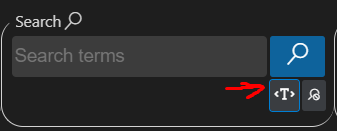
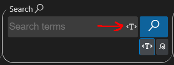
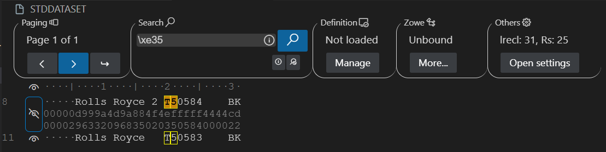

# Text mode documentation
## Table of contents
- [Text mode documentation](#text-mode-documentation)
	- [Table of contents](#table-of-contents)
	- [Introduction](#introduction)
	- [Use cases](#use-cases)
		- [Open a file](#open-a-file)
		- [Change Row Size](#change-row-size)
		- [Change Rows per page](#change-rows-per-page)
		- [Navigate to Another Page](#navigate-to-another-page)
		- [Make a selection with mouse](#make-a-selection-with-mouse)
		- [Make a selection with keyboard](#make-a-selection-with-keyboard)
			- [Simple selection](#simple-selection)
			- [Word selection](#word-selection)
			- [Multiple selection](#multiple-selection)
			- [Row selection](#row-selection)
			- [All selection](#all-selection)
		- [Peek at the underlying hexadecimal](#peek-at-the-underlying-hexadecimal)
		- [Undo](#undo)
		- [Redo](#redo)
		- [Copy text](#copy-text)
		- [Paste text](#paste-text)
		- [Edit segment](#edit-segment)
		- [Clone row](#clone-row)
		- [Append empty row](#append-empty-row)
		- [Insert empty row](#insert-empty-row)
		- [Delete this row](#delete-this-row)
		- [Search](#search)
			- [Advanced search](#advanced-search)

## Introduction
 The text mode provides fully hexadecimal integration and EBCDIC support for sequential data sets.

## Use cases

### Open a file

1. Open the dataset file
   1. Select "Open Anyway"
   2. Choose "z/OS File Editor"

### Change Row Size

1. Click "Open Settings" under Others
2. Manually adjust the "Row size" , or use the side buttons.
3. Press Enter to apply changes.

### Change Rows per page

1. Click "Open Settings" under Others
2. Manually adjust the "Rows per page" , or use the side buttons.
3. Press Enter to apply changes.
### Navigate to Another Page

Prerequisite: If the selected number of rows per page is smaller than the number of rows, pagination will be activated, showing page 1 of total numer of pages.

1. Click on the right-arrow icon to move to the next page.
2. Click on the left-arrow icon to move to the previous page.
3. Click on the arrow with the 'enter' symbol and input a number within the page range to go directly to that page.

### Make a selection with mouse

1. Press and hold on the text to expand the selection.

### Make a selection with keyboard

Prerequisite: Place the mouse cursor over the text to give it focus.

#### Simple selection

1. Press any arrow key on the text to create a basic selection, and move the selection in the direction of the arrow key.
#### Word selection

Note: Only combinations of numbers and letters are considered words.

1. Press left or right key plus ctrl key to move over the words.

#### Multiple selection

1. Press arrow keys plus shift key to make a multiple selection that grows when the combination is held down

#### Row selection

1. Right-click on any row, and the entire row will be selected.

#### All selection

Prerequisite: Focus on the text

1. Press ctrl + a, and the entire text will be selected, spanning all pages

### Peek at the underlying hexadecimal

Prerequisite: Having a dataset file opened, no copybook loaded.

1. Click the eye icon at the left of the lines.
2. Press the space bar on the row where a selection is active; the corresponding row will be highlighted with an eye icon

### Undo

1. Press ctrl+z to undo the last action

### Redo

1. Press ctrl+y to redo the last action

### Copy text

Prerequisite: Having a selection made

1. Made a selection and press ctrl+c or right button and select the option copy text

### Paste text

Prerequisite: Ensure there is content on the clipboard

1. Press ctrl+v or right button to paste the content from the clipboard where the selection is located

### Edit segment

Prerequisite:Having a selection made

1. Over the selection press the right button and press the edit segment option.
2. In the contextual menu, in the "Text" field delete the original selection and introduce the new one.
3. Pressing the Enter key will apply the changes, then press the "Confirm" button

### Clone row

1. Hover over any selection or simply right-click on any row, and then choose the "Clone this row" option.
2. Under the applied row, the clone will be added.

### Append empty row

1. Right-click on any row, select "Append empty row," and an empty row will be added below the selected row

### Insert empty row

1. Right-click on any row, select "Insert empty row", and a empty row will be added above the selected row

### Delete this row

1. Right-click on any row, select "Delete this row", and the selected row will be removed

### Search

1. Click on the search header input
2. Enter the string and click the search button(magnifying glass)
3. Navigate forward through the matches by clicking on the table and pressing the Tab key.
4. Navigate back through the matches by clicking on the table and pressing the Shift key.
5. Cancel the search mode by clicking the X button on the search header menu.

Notes: 
- If the search results contain multiple tables, to navigate between them you need to give focus by clicking on the one you want to move to.
- If the search results span multiple pages, we can still navigate through the resulting pages using the pagination menu buttons.
- If the search does not return any result, a warning message will be launched:"There are no matches".

#### Advanced search
The advanced search allows finding hexadecimal patterns with the addition of text.

1. Click on the advanced search button to enable advanced search 
2. An advance search icon will appear into the input box when the advanced search is enabled 
3. Click the advanced search button or cancel search button to disable the advanced search.
3. Click on the search header input
4. Enter a valid pattern for advanced search (Search for valid patterns in the pattern section).
5. The rest of functionality is the same as normal search.

- Notes:
	- If the search string is normal text, it will work as normal search.
	- If the search does not return any result, a warning message will be launched:"There are no matches".

- Valid patterns:
	- To search in hexadecimal mode, use \x follow by the hexadecimal number(\xd9)
	- Every hexadecimal number must be preceded by the \x format.
	- Characters can be used with hexadecimal numbers too
	- Normal numbers can be used with hexadecimal numbers too
	- Valid examples:
		- \x96
		

		- \xc2a\xa3
		

		- M\x81n
		

		- \xe35
		

