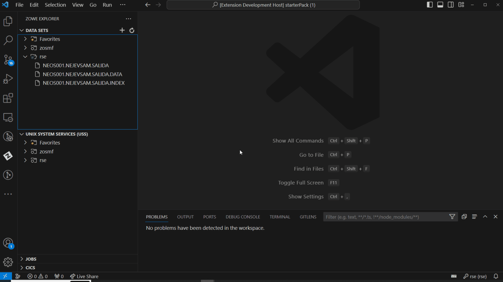
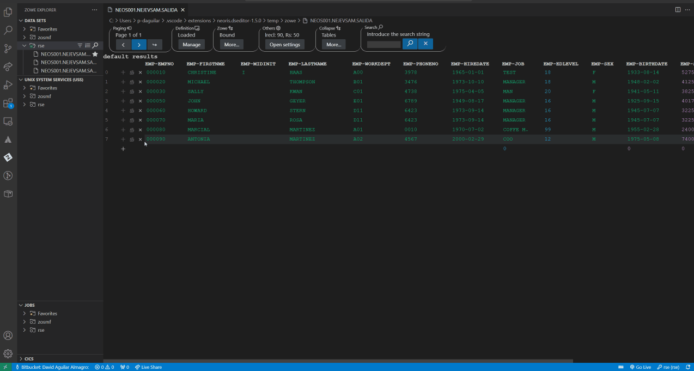
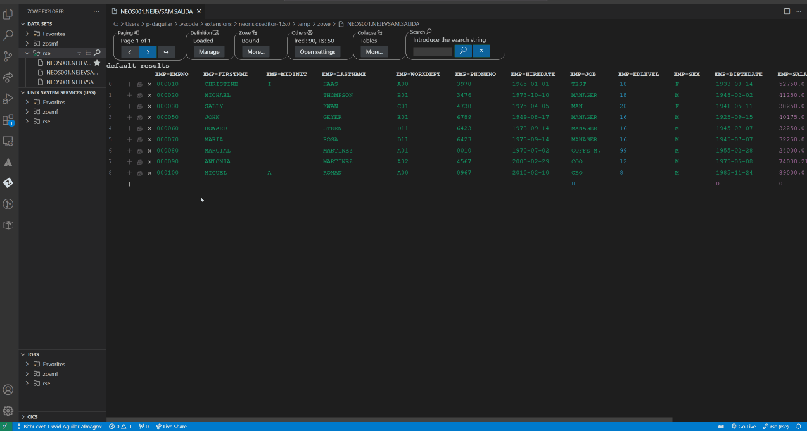
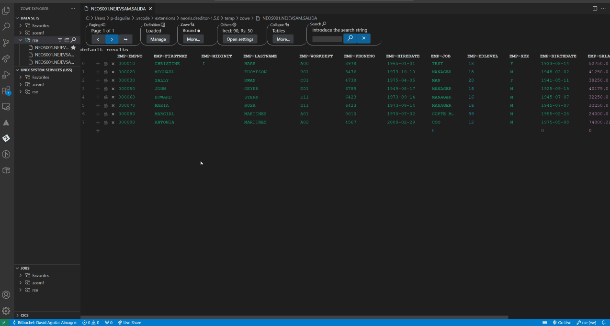
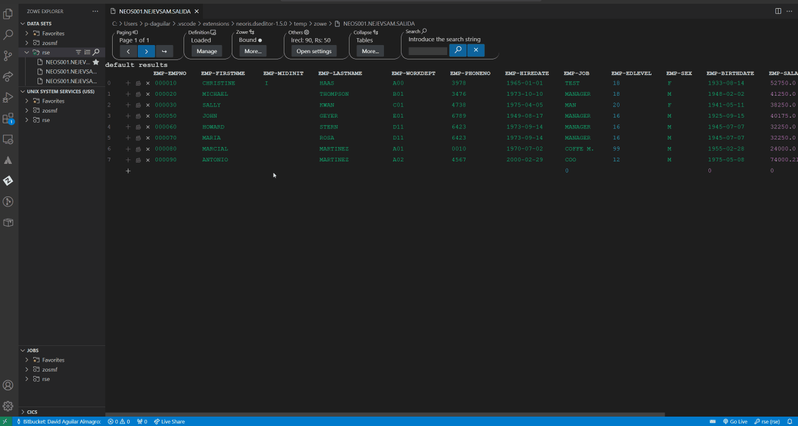

# VsamApi documentation <a id="documentation">

## Table of contents
- [VsamApi documentation ](#vsamapi-documentation-)
	- [Table of contents](#table-of-contents)
	- [Introduction](#introduction)
	- [Prerequisites ](#prerequisites-)
	- [Operating mode](#operating-mode)
	- [Use cases](#use-cases)
		- [Open a file](#open-a-file)
		- [Create a record](#create-a-record)
		- [Delete a record](#delete-a-record)
		- [Update a record](#update-a-record)
		- [Undo/Redo an action](#undoredo-an-action)
	- [Notes](#notes)

## Introduction
Optimize your operations with VSAM files using Neoris-vsam api in your mainframe. With the VSAM CRUD Extender, achieving CRUD (Create, Read, Update, Delete) in VSAM files is straightforward and effective. Designed to simplify your VSAM file management.

## Prerequisites 
To utilize the VSAM functionality, it is essential to have the Neoris-vsamapi and IBM rseapi installed on the mainframe, along with the Zowe Explorer extension in Visual Studio Code (VSCode).

## Operating mode
Is important to know that for every operation on the VSAM file(read, add, update and delete), the extension will make a request to the VSAM API.

## Use cases
Note: All the operations are explained in table mode (we recommend using this mode for these types of files).
### Open a file

1. Search the vsam file in zowe explorer in the Data Sets-> rse section
2. In the results, right-click on any of the three files associated with the VSAM file, and select "Open with NEORIS File Editor."

### Create a record

1. Click on the plus button where no record exists.
2. Fill in the fields (Based on the data type of each field, we control the data that is filled).
3. Click "Confirm" button to add the record.

### Delete a record

1.Click on the "x" button on the record that you want to delete

### Update a record

1. Click in the field of the record to update.
2. Change the content and click the confirm button.

### Undo/Redo an action 

1. With the delete action(is the same for every action), push "Ctrl + Z" to undo the action and push "Ctrl + Y" to redo.

Note: As mentioned in the [Operating mode](#operating-mode) section, for every undo/redo action, it will make a request to the VSAM API.

## Notes 

All the previous functionality explained in the [table mode](./table_mode.md) and [text mode](./text_mode.md) are the same with Neoris vsam api