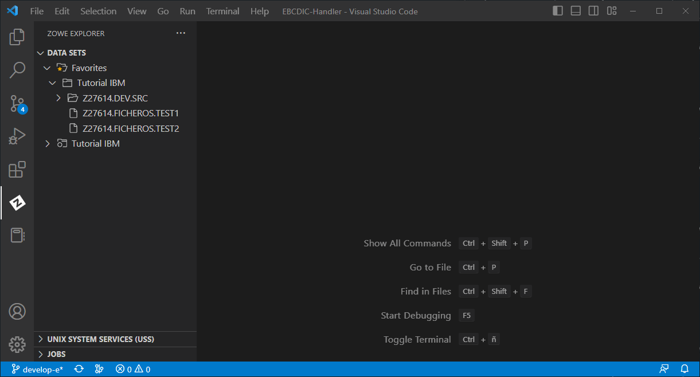
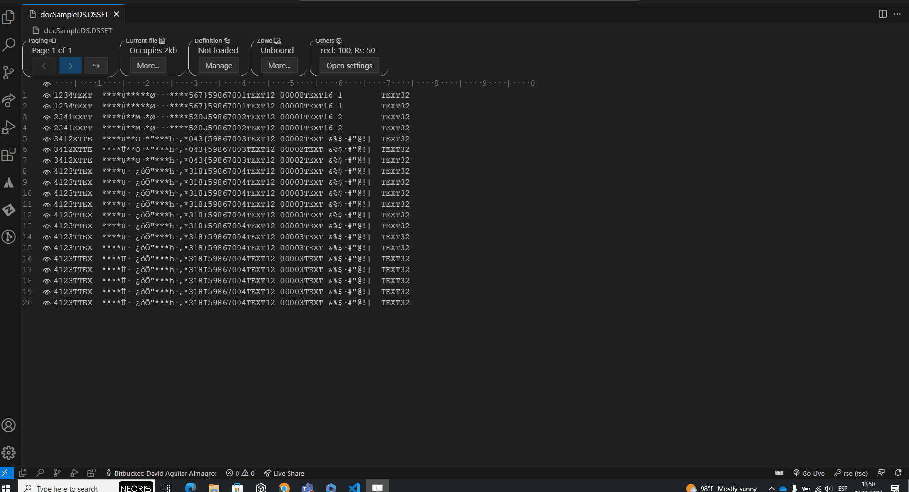
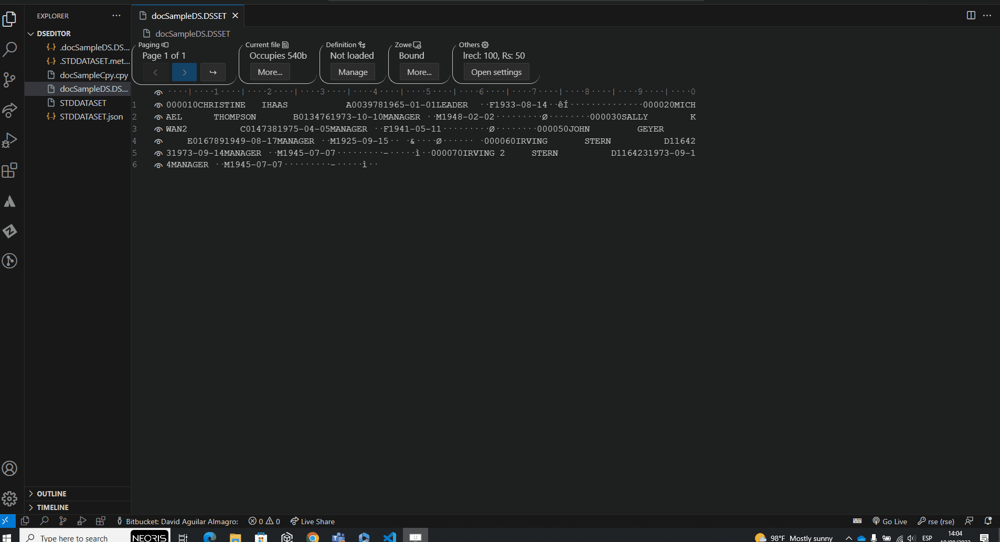
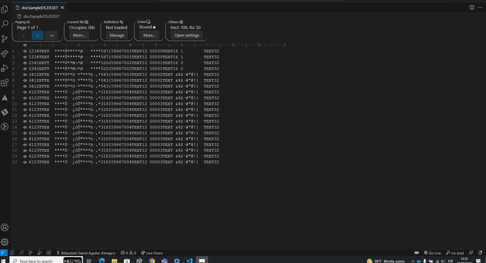

# Interopability with ZOWE Explorer documentation

## Table of contents
- [Interopability with ZOWE Explorer documentation](#interopability-with-zowe-explorer-documentation)
	- [Table of contents](#table-of-contents)
	- [Use cases](#use-cases)
		- [Load Dataset from Zowe explorer](#load-dataset-from-zowe-explorer)
		- [Bind DataSet from Zowe explorer](#bind-dataset-from-zowe-explorer)
		- [Unbind DataSet to Zowe explorer](#unbind-dataset-to-zowe-explorer)
		- [Download DataSet from Zowe explorer](#download-dataset-from-zowe-explorer)
		- [Upload DataSet to Zowe explorer(mainframe)](#upload-dataset-to-zowe-explorermainframe)

## Use cases

### Load Dataset from Zowe explorer

Prerequisite: Having a ZOWE connection opened.

1. Right-click a dataset file
2. Select "Open with NEORIS File Editor"

*Since the file will be downloaded first to the local file system, it might take a while*

### Bind DataSet from Zowe explorer

Prerequisite: Having a ZOWE connection opened.

1. Click on "Dataset name" field under Zowe.
2. Put the dataset name and click on check button

### Unbind DataSet to Zowe explorer

Prerequisite: Having a dataset binding.

1. Click on "Unbind" under Zowe

### Download DataSet from Zowe explorer

Prerequisite: Having a dataset binding.

Note: The content of the local dataset will be lost when downloading the dataset from the mainframe.

1. Click on "Download" under Zowe
2. Click yes in the message

### Upload DataSet to Zowe explorer(mainframe)

Prerequisite: Having a dataset binding.

1. Click on "Upload" under Zowe
